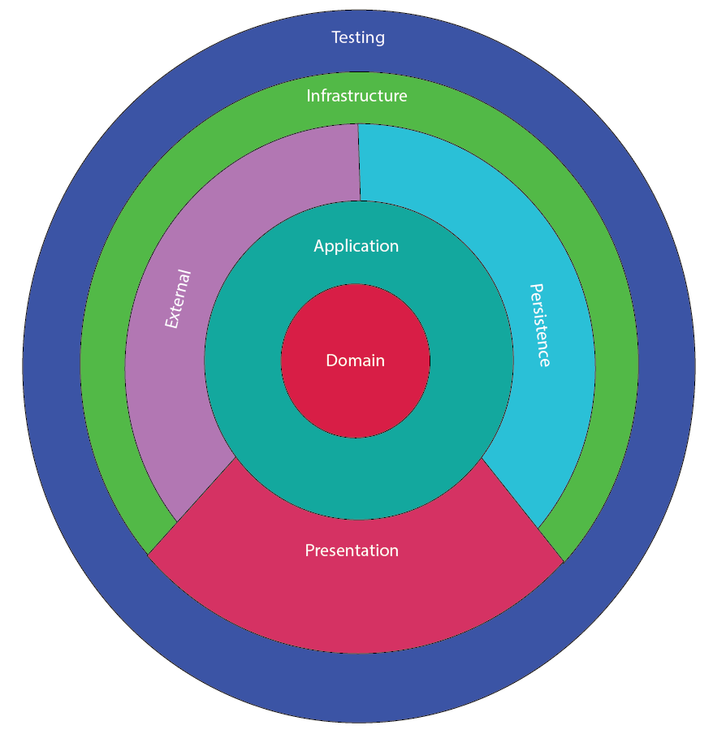
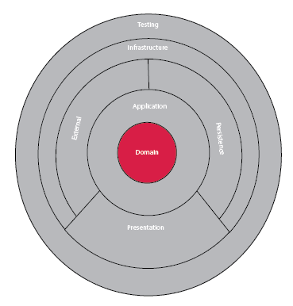
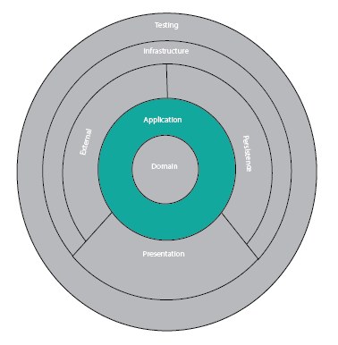
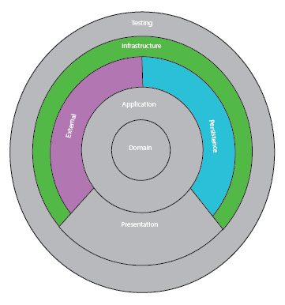
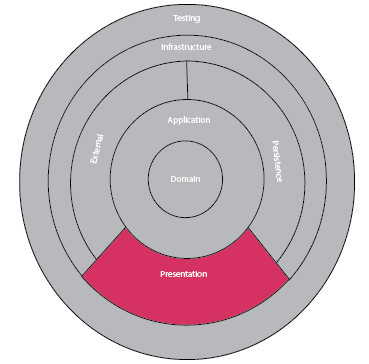
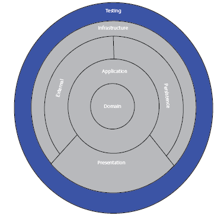

# ARQUITECTURA LIMPIA REACT NATIVE CON SAGA

[](https://github.com/evrone/go-clean-template/blob/master/LICENSE)
[](https://github.com/evrone/go-clean-template/releases/)

Esta arquitectura está diseñada para la implementación de una ARQUTIECRTURA LIMPIA para [React JS](https://reactjs.org)  aplicado [Redux](https://redux.js.org) y [Saga](https://redux-saga.js.org). 



## Estructura 
Para generar la estructura se creó una estructura fácil de implementar y mantener, basada una arquitectura limpia y flux. para nuestro caso se dividió en 5 capas la cuales deben respetar los principios SOLID y adaptarlos se acuerdo con las necesidades de la compañía. Cabe resaltar que esta estructura cambia un poco de lo que normalmente se trabaja ya que se quiere un desacoplamiento absoluto de la solución y a su vez garantizar el crecimiento de la aplicación a medida que la lógica se vuelva más compleja.

```
  project
    |
    |___ src /
    |      |
    |      |__ application /
    |      |
    |      |__ domain /
    |      |
    |      |__ infrastructure /
    |      |
    |      |__ presentation /
    |      |
    |      |__ app.tsx
    |      |
    |      |__ index.tsx
    |      |
    |      |__ react-app-end.d.ts
    |      |
    |      |__ reportWebVitals.ts
    |
    |___ test /
```

### Domain:
Esta capa es la encargada de manejar la definición, básicamente todas las clases e interfaces que sean de definición tales como DTO, entidades o abstracción de las definiciones debe quedar en esta capa. *Esta capa no debería tener referencia a ninguna otra capa* 


```
 domain/
    |___ interfaces/
    |       |
    |       |___ application/
    |       |
    |       |___ infrastructure/
    |       |       |
    |       |       |___ external/
    |       |       |
    |       |       |___ persistence/
    |       |
    |       |___ presentation/
    |
    |___ [module name]/
    |       |
    |       |____ models/
    |       |
    |       |____ states/
    |       |
    |       |____ dtos/
    |
    |___ dependencyInjectionDomain.tsx 
```
#### Interface:
Una interface se conoce como la definición, sin lógica basicamente solo una estructura, dentro de esta carpeta se usaran todas interfaces requeridas para la inyección de dependencias. Estas estarán organizadas por carpetas por cada capa como es application e infrastructure.

#### Module Name:
Para mantener el orden dentro del dominio se usará una carpeta por cada uno de los módulos o divisiones propias de cada proyecto. dentro de este se deben manejar una estructura dada por unas subcarpetas.

 - models: En esta carpeta contiene las clases que se podrán usar como entidades internas dentro de la solución, un ejemplo de esto puede ser al almacenar datos en memoria o al usar un storage local estas clases podrías realizar una serialización para mejorar la manipulación de los datos.
  
 - states: ya que manejamos redux se requieren estados dentro de la solución, en esta carpeta se guardaran todos los estados correspondientes al módulo. La idea es que estas clases sean las mismas que usamos en redux al consolidar los reducers.
  
 - dtos: Normalmente se requiere consumir servicios de API o Web Socket para eso se usara esta carpeta, se debe colocar en esta los request y los response necesarios para el trabajo requerido con los servicios externos.
  
#### dependencyInjectionDomain.tsx: 
En este archivo se agregar todas las inyecciones de dependencia que tiene la capa domain *si no se requiere se debe mantener por estructura de la solución*.

### Application:
Para el manejo de la lógica se usará esta capa, muchas personas catalogan esta capa como casos de uso para efectos prácticos los usaremos de la misma manera. Esta capa tiene la responsabilidad de manejar toda la lógica de negocio y si es posible toda la lógica de la solución. Es importante resaltar que muchas veces se cae en el error de repetir código en esta capa ya que al usar un patrón mediator separamos prácticamente cada una de las clases por funcionalidad y esto hace que se repita el muchas veces la lógica *en la medida de lo posible si llega a pasar esto enviar la lógica a una clase común en el common* pero se debe evaluar en qué casos vale la pena realizar esta operación.

Vale la pena resaltar que la única relación válida para aplicación es Domain no debe tener ninguna relación con persistence, external o con cualquier otra clase externa a application o domain 



```
 application/
    |
    |___ commons/
    |
    |___ [module name]/
    |       |
    |       |____ [Use case]Application.ts
    |       |
    |       |____ commons
    |       |
    |       |____ [Name Subprocess]/
    |
    |___ dependencyApplication.tsx 
```

#### Common:
En esta carpeta se incluye toda la lógica común dentro de la solución, es importante resaltar que si existe lógica que solo aplique a un módulo no debería ir en esta carpeta.

#### Module Name:
Para mejorar la organización se usarán carpetas con el nombre del módulo, estas contendrán un conjunto de lógica organizada en casos de uso los cuales resolverán o realizarán una sola acción. Esta clase debe tener un método handler el cual ejecutara la acción. Si se quieren usar más métodos deben ser private o protected.

- [Use case]Application.ts: Estos archivos deberán tener una única funcionalidad, dada en el método handler el cual se encargará de ejecutar el application
  
- Commons: toda la lógica común que aplique para el modulo debería ir en esta carpeta. Se debe evaluar si vale la pena pasar la lógica en esta parte ya que muchas veces todo se vuelve común y la lógica se vuelve compleja 

#### dependencyInjectionApplication.tsx
En este archivo se agregar todas las inyecciones de dependencia que tiene la capa application si no se requiere se debe mantener por estructura de la solución.

### Infrastructure:
Siempre que se quiera usar acceso a información externa ya sea una base de datos, servicios REST o cualquier tipo de repositorio se debe hacer en esta capa. Se debe resaltar que solo debe hacer la conexión no debe tener lógica de negocio y mucho menos integración directa con la capa application. También todas las clases deberían tener asociada una interface de domain si son consumidas desde application.

Importante saber que la única relación válida para infrastructure es Domain.



```
 infrastructure/
    |
    |___ external/
    |       |
    |       |____ [Provider Name]/
    |
    |___ persistence/
    |       |
    |       |____ repositories/
    |       |       |
    |       |       |____ [Name Segment]Repository.ts
    |       |
    |       |____ contexts/
    |
    |___ dependencyInfrastructure.tsx 
```

#### External: 
Toda conexión externa a la solución se debe realizar en esta carpeta ya sean servicios REST, Web Socket o similares. Se recalca que esta capa no debería tener lógica solo debe ser la conexión y si es necesario un mapeo a las clases requeridas para continuar con la ejecución. Toda conexión debe estar en una carpeta con el nombre del proveedor. Si son muchos llamados se debe dividir por carpetas internas de acuerdo con las necesidades de los llamados.

#### Persistence:
Para conexiones a base de datos o storage local debe trabajarse en esta carpeta, la idea es que si se llegue a cambiar de conexión el impacto sea mínimo y solo sea cambiar en este caso el contexto de llamado al proveedor.
- Repositories: Esta carpeta contara con un patrón repository separando la información de acuerdo a tablas o grupos de tablas relacionadas, si es necesario debería crear subcarpetas para mejorar el orden de la solución.
- Contexts: Estas son las conexiones a las bases de datos o storage locales. cómo se menciono anteriormente la idea es que estos puedan ser reemplazados o modificados con facilidad.

### Presentation:
Esta capa esta realizada con ReactJS y Redux Saga, Lo que se busca con esta capa es centralizar todo lo concerniente a visualización. Esta capa no debe tener lógica y debe ser manejada en su totalidad por Redux.



```
 presentation/
    |
    |___ commons/
    |       |
    |       |____ [Group Commons Name]/
    |
    |___ hooks/
    |       |
    |       |____ [Group Hooks Name]/
    |
    |___ components/
    |       |
    |       |____ [Component Name]/
    |                   |
    |                   |____ index.ts
    |                   |____ style.ts
    |____ layout/
    |        |
    |        |____ index.ts
    |        |____ style.ts
    |
    |___ pages/
    |       |
    |       |____ [Module Page]/
    |                   |
    |                   |____ components/
    |                   |        |____ [Component Name]/
    |                   |                   |____ index.ts
    |                   |                   |____ style.ts
    |                   |
    |                   |____ [Page Name]
    |                   |        |____ index.ts
    |                   |        |____ style.ts
    |                   |
    |                   |____ index.ts
    |___ redux/
    |       |
    |       |____ [Module Page]/
    |       |           |
    |       |           |____ actionCreator.ts
    |       |           |____ reducers.ts
    |       |
    |       |____ rootReducers.ts
    |       |
    |       |____ rootSagas.ts
    |       |
    |       |____ store.ts
    |      
    |____ routers/
    |        |
    |        |____ [Module Name]route.ts
    |        |
    |        |____ routes.ts
    |
    |____ static/
            |
            |____ images/
```
#### commons:
Para manejar todos lo utilitarios se debe usar la carpeta commons, esta puede tener internamente tener archivos .ts o carpetas agrupando funcionalidades.

#### hooks:
Si lo que se quiere es tener utilitarios para react se debe usar la carpeta hooks y como se ve con los commons se puede internamente agrupar en carpetas o manejar archivos individuales.

#### Components:
En esta carpeta se colocará todos los componentes genéricos que se repiten en varias páginas, si solo aplica para una página este no se debe pasar a esta carpeta. Todos los componentes deben estar en carpetas donde se debe separar los estilos de la interface

#### Layout:
Para el manejo de una página maestra se debe usar esta carpeta, se busca con esta carpeta generar toda base de diseño que se repite en todas las páginas, es importante resaltar que en esta carpeta solo deberá tener un index y un style si se requiere agregar componentes se debe usar la carpeta *components*

#### Page:
Por cada uno de los módulos se debe generar una carpeta esta tendrá de la carpeta, está siempre tendra un index.ts y un style.ts siempre y por cada uno de las páginas se debe crear una carpeta y en esta se colocara la interface llamada index.ts y el archivo style.ts. 

Adicional se debe tener un archivo index que reunirá todos los módulos de esa página.

#### Redux:
Esta carpeta es la que encapsulara todo redux saga dentro de la arquitectura. Lo que se busca es centralizar todo lo que tenga que ver con los estados y dividirlo de una manera fácil de manejar. Una opción adicional para esa carpeta es colocarla en infrastructure pero esta idea no se trabajó ya que no se mantiene el nivel de abstracción requerido ya con la capa infrastructure.

- Module Page: Nombre del módulo, dentro de este ser deben ubicar siempre los archivos con los mismos nombres. El actionCreator.tsx será usado para crear lo métodos necesarios el manejo de los estados, importante resaltar que en este archivo debería manejar las acciones y todo lo concerniente a inyección de dependencias. Por otro lado, los reducers.tsx como su nombre lo indica tendrá los reducers y adicional tendrá las acciones que ejecutaran.
  
- rootReducers.ts: En este archivo será el compendio de todos reducers de las carpetas.

- rootSagas.ts: Para poder trabajar sagas se debe usar este archivo para mezclar todos los actions creator de cada carpeta.

- store.ts: Este es el compendio de todo lo que se debe realizar con redux y lo que debe agregarse al final en el Provider de la App.tsx

#### Routers: 
Esta carpeta contiene todas las rutas a las cuales se podrá acceder, ser recomienda usar diferentes archivos con cada paquete de rutas.

#### Static:
Todas las imágenes y demás archivos estáticos llamados por react deberán ir en esta carpeta.


### Test
Es esta capa de colocaran todas las pruebas unitarias la idea es que el equipo si se requiere pueda usar TDD. En dado caso que no se use se debe crear todas las pruebas requeridas por capa, incluida presentación.


```
  test
    |
    |___ application /
    |
    |___ extend /
    |
    |___ infrastructure /
    |
    |___ mocks /
    |
    |___ presentation /
```

#### Application: 
En esta carpeta tendremos todas las pruebas de application, vale resaltar que solo se debe probar esta capa

#### Extend:
En esta carpeta se deben colocar todos los fakers y clases que ayuden a generar objetos para las pruebas 

#### Infrastructure:
Aqui deben ir todas las pruebas para las conexiones externas. Vale la pena resaltar que estas pruebas no deben incluir los llamados reales a los sevicios. Si solo es el llamado al servicio se debe usar inyección de dependencias u omitir esta prueba.

#### Mocks
Aqui se debe usar toda la configuracion requerida para el manejo de la libreria de mocks

#### Presentation
Todas las pruebas a la interface se deben manejar desde este punto, recordar que las pruebas se deben hacer por componente, pagina y demas partes de esta capa no crear una gran prueba con todos los componentes o con diferentes rutas